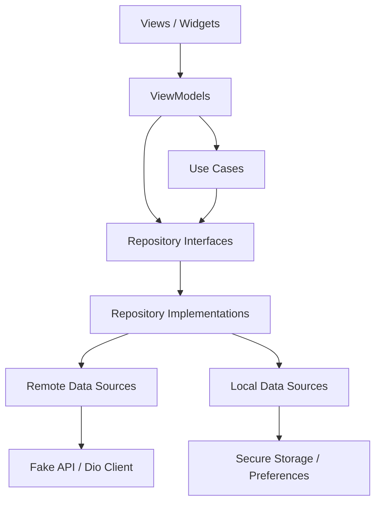

# Base Project — Flutter Architecture Starter

Production-oriented Flutter starter for medium and large apps.

**Stack:** Feature-first · MVVM · Selective use cases · Repository pattern · Riverpod · go_router · Fake API ready for Dio.

## Architecture overview

```
View → ViewModel → UseCase (when needed) → Repository interface
                                          → Repository implementation
                                          → Remote / local data source
```

Presentation never depends on Dio, SharedPreferences, secure storage, databases, or concrete repository implementations.

## Dependency flow



## Folder structure

```
lib/
  app/                  # Bootstrap, router, theme
  core/                 # Config, network, storage, errors, Result
  features/
    authentication/
    home/
    profile/
    settings/
  shared/               # Cross-feature providers & shell UI
  main_development.dart
  main_staging.dart
  main_production.dart
docs/architecture/      # Architecture decision records
test/
```

## Layer responsibilities

| Layer | Responsibility |
| --- | --- |
| Presentation | Declarative UI, ViewModels, sealed UI state |
| Domain | Entities, repository interfaces, selective use cases |
| Data | DTOs, mappers, fake/real data sources, repository impls |
| Core | Environment, networking, storage abstractions, logging |

## Why use cases are selective

Use cases exist only when they encode validation, orchestration, reuse, or an important business action (login, logout, update profile). Simple reads go ViewModel → repository interface.

## State management rules

- Riverpod is the only DI mechanism (no GetIt).
- Screen state uses sealed classes: initial / loading / success / empty / error.
- `ref.watch` for render-driving values; `ref.read` in handlers.
- No `BuildContext` in providers or repositories.

## Error handling strategy

Repositories return `Result<T>` (`Success` / `Failure`). Infrastructure errors become `AppException` via `ErrorMapper`. Unexpected errors are logged with stack traces.

## Authentication flow

1. Bootstrap restores session from secure storage.
2. Splash / init UI is shown until session state is known.
3. `go_router` redirects using `authSessionProvider`.
4. Login validates input, calls `LoginUseCase`, stores token + user.
5. Logout clears sensitive session data and returns to `/login`.

**Demo credentials**

- Email: `demo@example.com`
- Password: `Password123`

## Environment setup

Example env files (no real secrets):

- `.env.development`
- `.env.staging`
- `.env.production`

Keys:

```
API_BASE_URL=...
ENABLE_NETWORK_LOGS=true|false
ENABLE_DEBUG_TOOLS=true|false
```

## Commands

### Dependencies & codegen

```bash
flutter pub get
dart run build_runner build --delete-conflicting-outputs
```

### Run environments

```bash
flutter run -t lib/main_development.dart
flutter run -t lib/main_staging.dart
flutter run -t lib/main_production.dart
```

### Quality

```bash
dart format .
flutter analyze
flutter test
```

## Replacing fake APIs with real APIs

1. Implement `AuthRemoteDataSource` / `HomeRemoteDataSource` / `ProfileRemoteDataSource` with Dio (`ApiClient`).
2. Override the corresponding Riverpod providers (or swap the default implementation).
3. Keep DTO ↔ entity mapping inside the data layer.
4. Leave ViewModels and widgets unchanged.

## Adding a new feature (example: notifications)

1. Create `lib/features/notifications/{domain,data,presentation}`.
2. Add `Notification` entity + `NotificationsRepository` interface in domain.
3. Add DTO, fake/real data source, and `NotificationsRepositoryImpl` in data.
4. Add sealed `NotificationsState` + ViewModel + page in presentation.
5. Register providers and a protected route under the shell if needed.
6. Do **not** import another feature’s data or presentation layers.

Example domain contract:

```dart
abstract interface class NotificationsRepository {
  Future<Result<List<NotificationItem>>> getNotifications();
}
```

## Common mistakes to avoid

- Calling Dio or SharedPreferences from widgets/ViewModels
- Creating one-line use cases for every CRUD method
- Passing large domain objects through `GoRouter` `extra`
- Importing feature A’s data layer from feature B
- Swallowing exceptions without logging
- Navigating inside repositories

## Architectural decision records

See `docs/architecture/`:

1. Feature-first organization
2. Riverpod for state and DI
3. Selective use cases
4. Result / error handling
5. Environment configuration

## Package versions note

Dependencies were resolved against the installed Flutter/Dart SDK. Riverpod 2.x is used because Riverpod 3 / generator 4 require a newer analyzer/`meta` than this Flutter pin provides. Freezed + `json_serializable` still generate DTOs; ViewModels use explicit Riverpod providers for maximum compatibility.
