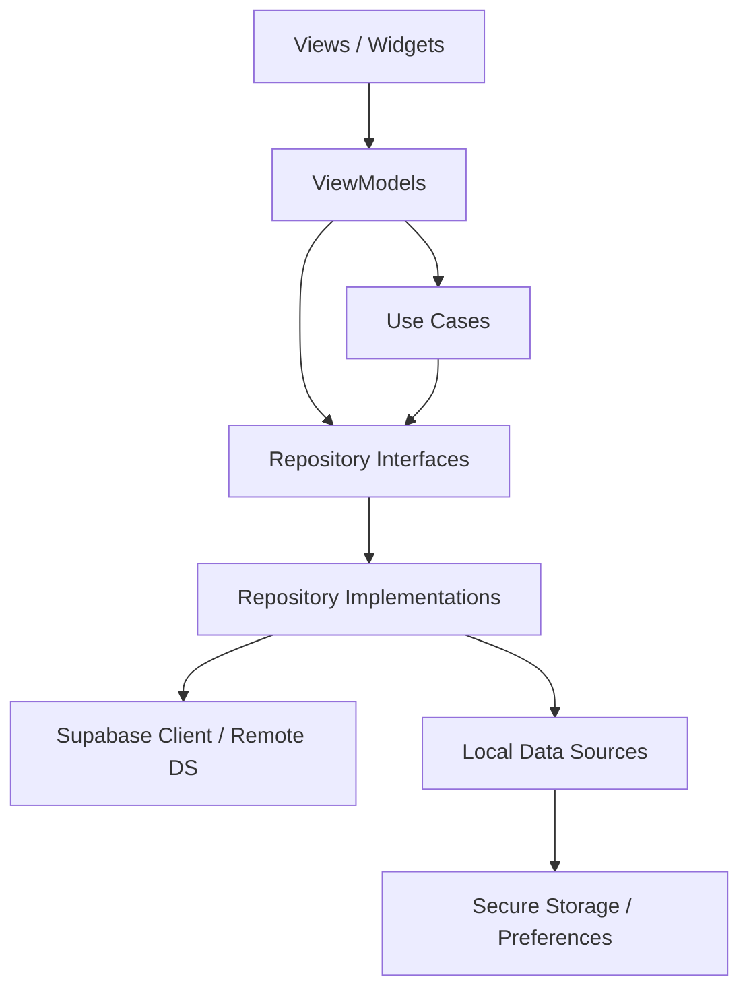

# Badminton Store

Flutter client for a badminton e-commerce shop backed by Supabase (Auth, PostgREST, Storage, trusted COD checkout RPC).

**Stack:** Feature-first · MVVM · Selective use cases · Repository pattern · Riverpod · go_router · `supabase_flutter`

## What is implemented

Authenticated commerce MVP path:

| Area | Status |
|------|--------|
| Auth (login, session restore, logout via Settings) | Wired to Supabase Auth + secure storage |
| Home (featured products) | Supabase `product_catalog` |
| Catalog (categories, brands, product list) | Supabase repositories |
| Product detail (variants, images, availability) | Supabase repositories |
| Search | `search_products` RPC |
| Favorites | Own-row RLS repository |
| Cart | Own-cart RLS repository |
| Checkout (COD) | Trusted `checkout_cod` RPC only — client totals are estimates |
| Orders (history) | Read-only own-order repository |
| Addresses (CRUD + validated create/edit form) | Own-row RLS repository |
| Profile | Supabase profile data source |
| Settings / appearance | Local preferences + logout |
| Notifications | Placeholder UI only — no schema, repository throws if read |

## Architecture overview

```
View → ViewModel → UseCase (when needed) → Repository interface
                                          → Repository implementation
                                          → Supabase client / data source
```

Presentation never depends on Dio, SharedPreferences, secure storage, databases, or concrete repository implementations.

## Dependency flow



## Folder structure

```
lib/
  app/                  # Bootstrap, router, theme, configuration-error UX
  core/                 # Config, errors, Result, Supabase helpers
  features/             # authentication, home, catalog, product, cart,
                        # checkout, orders, favorites, addresses, search,
                        # profile, settings, notifications (placeholder)
  shared/               # Cross-feature providers & shop UI
  main_development.dart
  main_staging.dart
  main_production.dart
docs/                   # Architecture, coding guidelines, audits, backend notes
supabase/               # Migrations (source of truth), seed, local DB tests
test/
```

## Layer responsibilities

| Layer        | Responsibility                                          |
| ------------ | ------------------------------------------------------- |
| Presentation | Declarative UI, ViewModels, sealed UI state             |
| Domain       | Entities, repository interfaces, selective use cases    |
| Data         | DTOs, mappers, Supabase data sources, repository impls  |
| Core         | Environment, Supabase config/init, storage, logging     |

## Security (client)

- Flutter may contain only a Supabase **publishable** key or legacy **anon** key.
- Never put a `service_role` / secret key, database password, or other credentials in the app or git.
- Authorization, order totals, inventory reservation, and privileged transitions are enforced server-side (RLS + `checkout_cod`). See `docs/architecture.md` and `docs/backend/checkout_security.md`.

## Environment setup

Copy `.env.example` into the env file for the flavor you run (do not commit real secrets):

- `.env.development`
- `.env.staging`
- `.env.production`

Keys (placeholders only — see `.env.example`):

```
API_BASE_URL=...
ENABLE_NETWORK_LOGS=true|false
ENABLE_DEBUG_TOOLS=true|false
SUPABASE_URL=https://YOUR_PROJECT_REF.supabase.co
SUPABASE_PUBLISHABLE_KEY=YOUR_PUBLISHABLE_KEY
SUPABASE_ANON_KEY=YOUR_PUBLISHABLE_OR_LEGACY_ANON_KEY
```

If URL/key configuration is incomplete, bootstrap shows `ConfigurationErrorApp` instead of mounting the normal provider graph.

## Commands

### Dependencies

```bash
flutter pub get
```

CMS dependencies:

```bash
cd cms && npm ci
```

Codegen (Freezed / json_serializable) when models change:

```bash
dart run build_runner build --delete-conflicting-outputs
```

### Run environments

```bash
flutter run -t lib/main_development.dart
flutter run -t lib/main_staging.dart
flutter run -t lib/main_production.dart
```

### Quality

```bash
dart format .
flutter analyze
flutter test
python3 scripts/automation.py policy-check
```

CMS quality:

```bash
cd cms && npm run format:check
cd cms && npm run lint
cd cms && npm run typecheck
cd cms && npm test -- --run
cd cms && npm run build
```

### CMS environment and development

Copy `cms/.env.example` to `cms/.env.local` for local work. The scaffold accepts
only these public values:

```bash
NEXT_PUBLIC_SUPABASE_URL=https://YOUR_PROJECT_REF.supabase.co
NEXT_PUBLIC_SUPABASE_PUBLISHABLE_KEY=YOUR_PUBLISHABLE_KEY
```

Start the CMS locally with:

```bash
cd cms && npm run dev
```

The CMS now uses cookie-based Supabase SSR authentication with three distinct
boundaries:

- `cms/src/lib/supabase/browser.ts` for browser auth UI work
- `cms/src/lib/supabase/server.ts` for request-scoped server reads/actions
- `cms/src/proxy.ts` for optimistic session refresh and cookie forwarding

Protected CMS access validates identity with `supabase.auth.getClaims()` and
authorizes only from the caller's trusted `public.profiles.role` plus
`is_active`. Only active `staff` and active `admin` profiles can reach the CMS
dashboard.

The dashboard segment provides a shared application shell (sidebar/mobile nav,
breadcrumbs, account/logout, loading/empty/error/confirmation primitives) plus
placeholder routes for categories, brands, products, and inventory. Catalog CRUD
arrives in later CMS tasks.

There is no CMS self-signup flow. Before first use, a trusted operator must
manually create or promote the initial active admin profile in Supabase.

### Local Supabase database regressions

Requires Docker + Supabase CLI. Against a **local disposable** stack only (`supabase db reset` first). See `supabase/README.md` for details.

```bash
supabase db reset
psql "$DATABASE_URL" -v ON_ERROR_STOP=1 -f supabase/tests/database/00_constraints.sql
bash supabase/tests/database/01_rls_checklist.sh
psql "$DATABASE_URL" -v ON_ERROR_STOP=1 -f supabase/tests/database/02_product_variant_cost_price.sql
psql "$DATABASE_URL" -v ON_ERROR_STOP=1 -f supabase/tests/database/03_trusted_cod_checkout.sql
psql "$DATABASE_URL" -v ON_ERROR_STOP=1 -f supabase/tests/database/04_trigger_function_execute.sql
psql "$DATABASE_URL" -v ON_ERROR_STOP=1 -f supabase/tests/database/05_explicit_data_api_grants.sql
bash supabase/tests/database/03_trusted_cod_checkout_concurrency.sh
```

Never run destructive resets against a linked remote production project from this README.

## State management rules

- Riverpod is the only DI mechanism (no GetIt).
- Screen state uses sealed classes: initial / loading / success / empty / error.
- `ref.watch` for render-driving values; `ref.read` in handlers.
- No `BuildContext` in providers or repositories.

## Error handling strategy

Repositories return `Result<T>` (`Success` / `Failure`). Infrastructure errors become `AppException` via `ErrorMapper` / `SupabaseExceptionMapper`. Unexpected errors are logged with stack traces.

## Adding a new feature

1. Create `lib/features/<name>/{domain,data,presentation}` (+ `di/` providers).
2. Add entities + repository interface in domain.
3. Add DTO, Supabase data source / repository impl in data.
4. Add sealed state + ViewModel + page in presentation.
5. Register providers and routes; do **not** import another feature’s data or presentation layers.

**Notifications** remain unimplemented (placeholder page; no table). Do not treat them as a wired commerce feature.

## Common mistakes to avoid

- Calling Dio or SharedPreferences from widgets/ViewModels
- Creating one-line use cases for every CRUD method
- Passing large domain objects through `GoRouter` `extra`
- Importing feature A’s data layer from feature B
- Trusting client-calculated checkout totals or inventory
- Embedding service-role keys in Flutter
- Swallowing exceptions without logging
- Navigating inside repositories

## Further reading

- `docs/architecture.md` — current system architecture
- `docs/coding_guidelines.md` — contributor conventions (including money)
- `docs/audits/application-readiness.md` — readiness matrix and remaining work
- `docs/architecture/` — ADRs (feature-first, Riverpod, selective use cases, Result, env)
- `supabase/README.md` — local DB / grants / regression commands
- `docs/backend/` — checkout security and Flutter integration notes

## Package versions note

Dependencies are resolved against the installed Flutter/Dart SDK. Riverpod 2.x is used because Riverpod 3 / generator 4 require a newer analyzer/`meta` than this Flutter pin provides. Freezed + `json_serializable` generate DTOs; ViewModels use explicit Riverpod providers.
