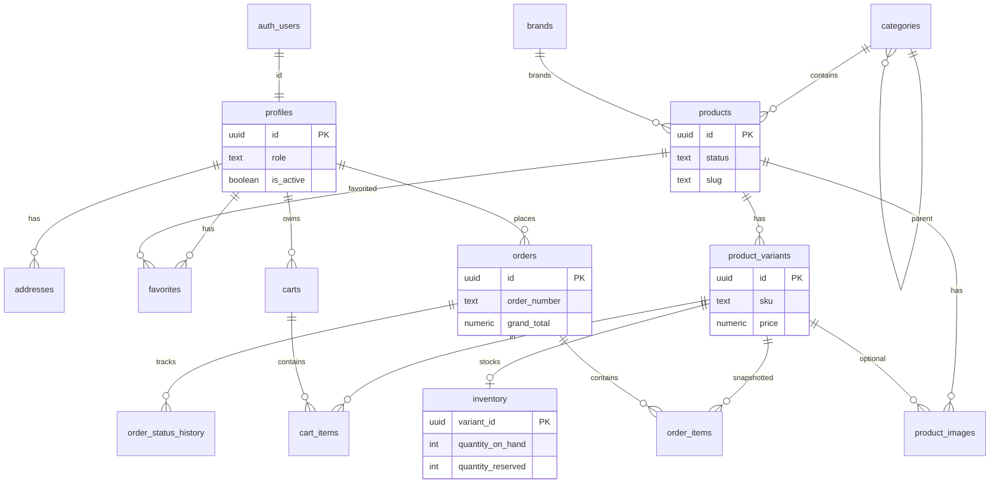

# Database ERD

```mermaid
erDiagram
  auth_users ||--|| profiles : "id"
  profiles ||--o{ addresses : has
  profiles ||--o{ favorites : has
  profiles ||--o{ carts : owns
  profiles ||--o{ orders : places
  categories ||--o{ categories : parent
  categories ||--o{ products : contains
  brands ||--o{ products : brands
  products ||--o{ product_variants : has
  products ||--o{ product_images : has
  products ||--o{ favorites : favorited
  product_variants ||--o| inventory : stocks
  product_variants ||--o{ product_images : optional
  product_variants ||--o{ cart_items : in
  product_variants ||--o{ order_items : snapshotted
  carts ||--o{ cart_items : contains
  orders ||--o{ order_items : contains
  orders ||--o{ order_status_history : tracks

  profiles {
    uuid id PK
    text role
    boolean is_active
  }
  products {
    uuid id PK
    text status
    text slug
  }
  product_variants {
    uuid id PK
    text sku
    numeric price
  }
  inventory {
    uuid variant_id PK
    int quantity_on_hand
    int quantity_reserved
  }
  orders {
    uuid id PK
    text order_number
    numeric grand_total
  }
```
