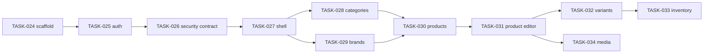

# CMS delivery roadmap

Each item is delivered on one automation branch and one pull request. Cursor
implements and runs the declared gates; Codex reviews the scoped diff and merges
only after approval.

## Milestone 1: foundation

### TASK-024 — Scaffold Next.js CMS

Create the independent `cms/` application, feature-first boundaries, environment
contract, baseline UI, tests, CI, and developer commands. No live auth or catalog
CRUD is introduced.

### TASK-025 — Supabase SSR authentication

Add login/logout, cookie session refresh, staff/admin route protection,
unauthorized UX, active-profile checks, and network-free authentication tests.

### TASK-026 — CMS database security contract

Add executable customer/staff/admin regressions for catalog and Storage access.
Provide a least-privilege staff/admin contract for reading variant cost price
without restoring that column to all authenticated users.

### TASK-027 — Dashboard shell

Build responsive navigation, breadcrumbs, account controls, reusable loading,
empty, error, and confirmation patterns, plus a lightweight dashboard.

## Milestone 2: product-management MVP

### TASK-028 — Category management

Paginated category listing, create/edit, hierarchy validation, activation, and
category asset handling. Delivered as TASK-032 in the automation backlog.

### TASK-029 — Brand management

Paginated brand listing, create/edit, activation, uniqueness validation, and
logo handling. Delivered as TASK-033 in the automation backlog.

### TASK-030 — Product explorer

Server-side pagination, search, filters, sorting, status visibility, price range,
and inventory summary without unbounded table reads. Delivered as TASK-034 in the
automation backlog.

### TASK-031 — Product editor

Create/edit core product data, category, brand, slug, specifications, draft and
publish validation, with server-side validation and sanitized failures.

### TASK-032 — Variant editor

Manage SKUs, attributes, selling prices, compare-at prices, the protected cost
price contract, defaults, and uniqueness constraints. Delivered as TASK-036 in
the automation backlog.

### TASK-033 — Inventory adjustments

Introduce atomic stock adjustment with reason/history, concurrency protection,
least-privilege execution, and negative authorization tests.

### TASK-034 — Product media manager

Upload, validate, order, select primary, replace, and delete product images with
Storage/database compensation for partial failures.

Completion of TASK-034 defines the product-management MVP.

## Milestone 3: store operations

- **TASK-035:** order search, detail, and trusted status transitions.
- **TASK-036:** operational dashboard for sales and low-stock signals.
- **TASK-037:** admin-only staff invitation, activation, and role management.
- **TASK-038:** immutable audit trail for privileged changes.

## Milestone 4: production readiness

- **TASK-039:** end-to-end, accessibility, security, and failure recovery suite.
- **TASK-040:** staging/production deployment, monitoring, backup checks, and
  operational runbook.

## Dependency order

Tasks may be split further when their threat model or diff becomes too large,
but they must not be combined in ways that bypass review gates.
