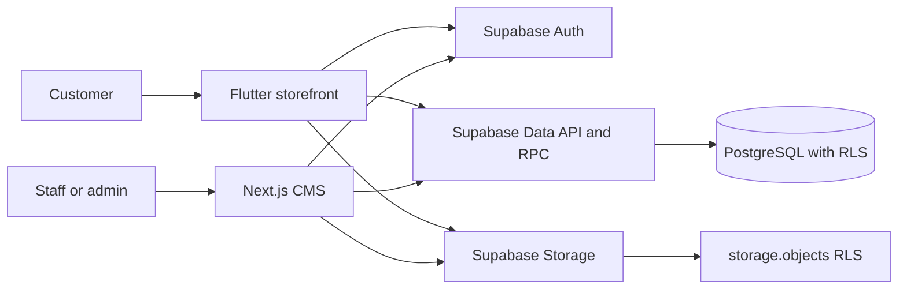

# CMS system architecture

## Context

Badminton Store has two user experiences backed by one Supabase project:

- the existing Flutter storefront for customers;
- a Next.js CMS for staff and administrators.

The CMS is a separate deployable under `cms/`. Keeping it in the same repository
allows schema migrations, security tests, and client changes to be reviewed
together without restructuring the existing Flutter application.



## Technology baseline

| Concern | Choice | Boundary |
| --- | --- | --- |
| Web framework | Next.js App Router with TypeScript | `cms/` only |
| Authentication | Supabase Auth with cookie-based SSR | Shared identities |
| Data access | `@supabase/supabase-js` through `@supabase/ssr` | User-scoped JWT and RLS |
| Database | Existing Supabase Postgres | `supabase/migrations/` is authoritative |
| Files | Existing Supabase Storage buckets | Paths stored in database rows |
| Styling | Tailwind CSS baseline | CMS-local design system |
| Unit/component tests | Vitest and Testing Library | No live Supabase dependency |
| Browser tests | Playwright | Critical staff workflows |
| Package manager | npm with committed lockfile | Versions pinned by the generated lockfile |

Dependencies must be verified against current official documentation when each
task is implemented. `@supabase/ssr` is evolving, so its client and proxy setup
must not be copied from old auth-helper examples.

## Runtime boundaries

### Browser

- May receive only the Supabase project URL and publishable key.
- Uses a browser Supabase client for interactive UI where required.
- Never receives a secret key, service-role key, database password, or private
  integration credential.
- UI permission checks improve usability but are not an authorization boundary.

### Next.js server

- Uses the authenticated user's cookie session for normal catalog mutations.
- Revalidates identity and role for every Server Action and Route Handler.
- Centralizes access in a data-access layer and returns narrow DTOs.
- Does not use ISR or shared public caching for authenticated pages.
- May use server-only credentials only for a separately approved operation that
  cannot be implemented safely with user-scoped RLS. Such use requires its own
  threat model, task, tests, and environment configuration.

### Supabase

- Auth proves identity.
- Grants decide whether a Postgres role can invoke an operation.
- RLS and trusted database functions enforce row-level authorization.
- Storage policies enforce bucket and object operations.
- Database constraints and RPCs enforce business invariants atomically.

## Proposed CMS source layout

```text
cms/
├── app/
│   ├── (auth)/
│   ├── (dashboard)/
│   └── api/
├── features/
│   ├── auth/
│   ├── categories/
│   ├── brands/
│   ├── products/
│   ├── variants/
│   ├── inventory/
│   └── media/
├── components/
│   ├── ui/
│   └── layout/
├── lib/
│   ├── supabase/
│   ├── auth/
│   ├── validation/
│   └── errors/
├── tests/
└── e2e/
```

Feature modules own their UI, validation, queries, mutations, DTOs, and tests.
Shared Supabase clients and authorization helpers live in `lib/`; feature code
must not instantiate ad-hoc clients or read secrets directly.

### Dashboard shell

The protected dashboard segment lives under `cms/src/app/dashboard/`:

- `layout.tsx` authorizes with `authorizeCmsRequest`, stays
  `force-dynamic`, and renders the shared shell with only serializable profile
  fields (`fullName`, `role`).
- Client Components are limited to navigation interactions, pathname-derived
  UI, logout pending state, confirmation dialogs, and error-boundary reset.
- Typed routes in `cms/src/lib/navigation/dashboard-routes.ts` drive primary
  navigation and breadcrumbs. Unknown descendants use a stable safe label and
  must not echo attacker-controlled path text.
- Shared page-state primitives live in `cms/src/components/ui/` and are reused
  by dashboard `loading.tsx` / `error.tsx` plus upcoming catalog screens.

Catalog CRUD pages should plug into this shell rather than inventing a second
application chrome or client-side authorization path.

Category management lives under `cms/src/features/categories/` with App Router
pages at `cms/src/app/dashboard/categories/`. List reads use explicit columns,
clamped pagination, and deterministic `sort_order, name, id` ordering. Mutations
are Server Actions that call `authorizeCmsRequest` again, validate hierarchy,
and compensate Storage uploads against `category-assets`.

Brand management lives under `cms/src/features/brands/` with App Router pages at
`cms/src/app/dashboard/brands/`. List reads use explicit brand columns, clamped
pagination, and the same deterministic `sort_order, name, id` ordering.
Mutations are Server Actions that call `authorizeCmsRequest` again, validate
optional HTTPS website URLs, treat slug uniqueness conflicts as field errors,
and compensate Storage uploads against `brand-assets`. Logo previews use the
public object URL and never inline SVG.

Product explorer lives under `cms/src/features/products/` with the App Router
page at `cms/src/app/dashboard/products/`. The paged aggregate result comes from
`public.list_cms_products`, which filters, sorts, and counts in Postgres with an
`id` tie-breaker before offset/limit. Related image and name reads are batched
for the current product page only. The page calls `authorizeCmsRequest` before
operational inventory reads and never selects `cost_price`.

Variant management lives under `cms/src/features/variants/` with App Router
pages at `cms/src/app/dashboard/products/[productId]/variants/`. A bounded
explicit-column variant read is merged with `get_staff_variant_costs` by id.
Create and update are Server Actions that re-authorize, bind `productId` /
`variantId` from the route, and call `save_cms_product_variant`. Cost appears
only in this authorized editor; barcode is never listed or prefilled.

Inventory management lives under `cms/src/features/inventory/` with App Router
pages at `cms/src/app/dashboard/inventory/` and
`cms/src/app/dashboard/inventory/[variantId]/`. The explorer page comes from
`public.list_cms_inventory`, which filters, sorts, and counts in Postgres with a
`variant_id` tie-breaker before offset/limit. The page calls
`authorizeCmsRequest` before operational inventory reads and never selects
`cost_price` or `barcode`. Adjustments are a Server Action that re-authorizes,
binds `variantId` from the route, calls `adjust_cms_inventory`, and fail-closes
unless the RPC returns exactly one `variant_id` row matching that route id.

Product media lives under `cms/src/features/media/` with the App Router page at
`cms/src/app/dashboard/products/[productId]/media/`. The page calls
`authorizeCmsRequest` before listing images. Mutations are Server Actions that
re-authorize, bind `productId` / `imageId` from the route, and never trust form
`product_id`, `storage_path`, actor, or role. Primary switches use
`set_cms_product_image_primary`; reordering uses `reorder_cms_product_images`.
Both are SECURITY INVOKER with empty `search_path`. Upload creates the Storage
object first, then the database row. Replacement uploads a new unique object,
updates the path, then deletes the old object. Deletion removes the database
row after promoting a remaining in-scope primary, so a catalog row never
points at a missing file; Storage cleanup is best-effort and retryable.

## Catalog data flow

### Read

1. An authenticated request reaches a protected Next.js route.
2. The server validates the session and trusted `profiles.role`.
3. The data-access layer issues an explicit-column, paginated query with the
   user's JWT.
4. Postgres grants and RLS apply.
5. A narrow DTO is returned to the component.

### Mutation

1. The form validates input on the client for quick feedback.
2. A Server Action or Route Handler validates the payload again.
3. The server rechecks identity and staff/admin authorization.
4. Supabase executes with the user's JWT; RLS remains the final access control.
5. Database constraints or a task-specific RPC enforce atomic invariants.
6. The CMS revalidates affected pages and reports a sanitized result.

### Images

Catalog assets use the existing `product-images`, `brand-assets`, and
`category-assets` buckets. Upload, replacement, and deletion go through the
Storage API. Database rows store object paths, not signed or public URLs.
Partial failures must be compensated so an abandoned object or broken database
reference is not silently left behind.

## Deployment model

The CMS and Flutter app release independently. Recommended environments are
local, staging, and production, each pointing to the matching Supabase project.
Deployment configuration must provide public values separately from server-only
secrets and must fail fast when required variables are missing.

The initial CMS can be deployed to Vercel, but the application remains portable:
no product rule may depend on a Vercel-only service. A Go service can be added
later for workers, large imports, ERP synchronization, or high-throughput
webhooks without replacing the CMS.

## Quality gates

Every CMS pull request must run, as applicable:

- dependency installation from the committed lockfile;
- formatting and linting;
- TypeScript type checking;
- unit/component tests;
- production build;
- relevant Playwright tests;
- database/RLS tests for schema or authorization changes;
- secret and allowed-path policy checks.

Tests must not claim a live Supabase operation passed unless it actually ran.
